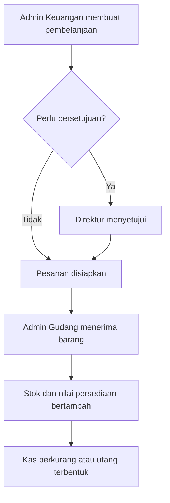
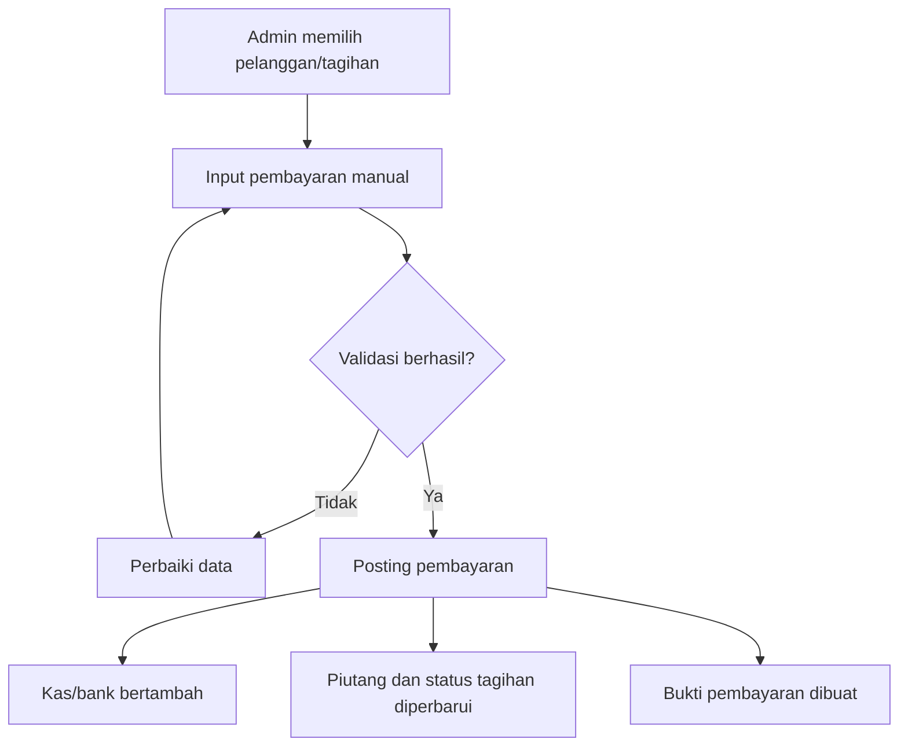
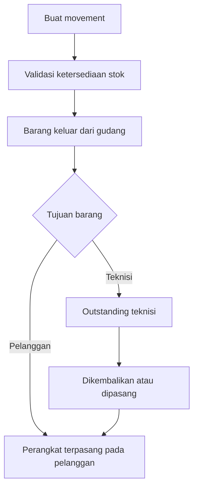
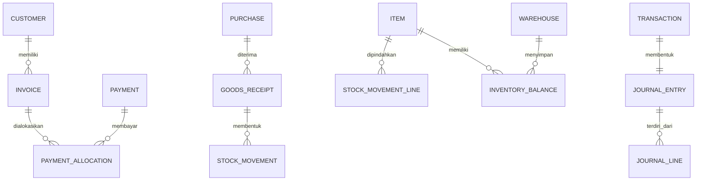
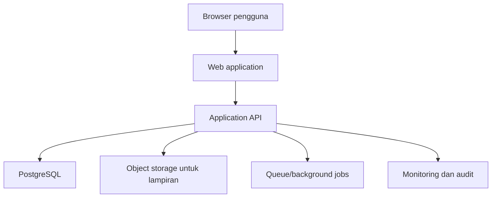

# BLUEPRINT APLIKASI ISPfinance V1.0

> Sistem keuangan, penagihan pelanggan, dan inventory terpadu untuk perusahaan Internet Service Provider (ISP).

| Informasi | Nilai |
|---|---|
| Nama aplikasi | ISPfinance |
| Versi blueprint | 1.0 |
| Jenis aplikasi | Web responsif |
| Skala awal | Di bawah 500 pelanggan |
| Pengguna utama | Pemilik/Direktur, Admin Keuangan, Admin Gudang |
| Metode pembayaran V1.0 | Dicatat manual |
| Status dokumen | Baseline pengembangan |
| Tanggal | 28 Agustus 2026 |

---

## 1. Ringkasan Eksekutif

ISPfinance V1.0 adalah aplikasi web untuk menyatukan proses keuangan, tagihan pelanggan, pembelanjaan, serta inventory perusahaan ISP dalam satu sistem. Aplikasi dirancang dengan antarmuka profesional, elegan, dan mudah dipahami pengguna nonteknis.

Nilai utama aplikasi:

- Memberikan satu sumber data untuk keuangan, tagihan, dan stok.
- Menghubungkan pembelanjaan secara langsung dengan penerimaan stok barang.
- Menampilkan posisi kas, piutang, utang, pendapatan, biaya, dan stok secara cepat.
- Melacak perpindahan barang antara gudang, cabang, teknisi, dan pelanggan.
- Mengurangi pencatatan ganda dan kesalahan laporan melalui jurnal otomatis.
- Menyediakan kontrol akses serta jejak audit untuk setiap aktivitas penting.

## 2. Sasaran dan Batasan Produk

### 2.1 Sasaran V1.0

1. Memusatkan pencatatan transaksi kas dan bank.
2. Mengelola utang usaha dan piutang pelanggan.
3. Mencatat anggaran bulanan serta persetujuan biaya.
4. Mengelola tagihan dan pembayaran pelanggan secara manual.
5. Mengelola master barang, stok gudang, movement, dan outstanding.
6. Menghasilkan laporan laba rugi, arus kas, piutang pelanggan, dan stock on hand.
7. Menyediakan dashboard ringkas untuk pengambilan keputusan.
8. Menyediakan Settings untuk pengguna, perusahaan, akun, gudang, dan parameter sistem.

### 2.2 Di Luar Cakupan V1.0

Fitur berikut disiapkan sebagai pengembangan lanjutan dan tidak wajib pada peluncuran awal:

- Payment gateway dan rekonsiliasi mutasi bank otomatis.
- Pembuatan tagihan bulanan otomatis.
- Notifikasi WhatsApp atau email otomatis.
- Integrasi isolir pelanggan ke router/RADIUS/MikroTik.
- Aplikasi mobile native untuk teknisi.
- Akuntansi pajak lengkap dan pelaporan pajak elektronik.
- Multi-currency dan konsolidasi multi-perusahaan.
- Forecast berbasis kecerdasan buatan.

## 3. Prinsip Desain Produk

1. **Mudah dipahami:** label menggunakan bahasa operasional, bukan istilah teknis yang membingungkan.
2. **Satu tindakan utama per halaman:** tombol utama dibuat menonjol dan konsisten.
3. **Data mudah dicari:** halaman dengan banyak data memiliki pencarian, filter, sortir, dan pagination.
4. **Kesalahan dapat dicegah:** validasi, konfirmasi, status, dan peringatan ditampilkan sebelum data diproses.
5. **Transaksi dapat ditelusuri:** setiap dokumen memiliki nomor, status, pembuat, waktu, dan riwayat perubahan.
6. **Keuangan dan stok konsisten:** proses operasional membentuk jurnal dan movement otomatis sesuai aturan.
7. **Informasi sensitif dibatasi:** data serta tindakan ditampilkan sesuai peran dan izin pengguna.

## 4. Pengguna dan Hak Akses

### 4.1 Peran Pengguna

| Peran | Tanggung jawab utama |
|---|---|
| Pemilik/Direktur | Memantau dashboard, melihat seluruh laporan, menyetujui anggaran/pengeluaran, dan mengawasi audit |
| Admin Keuangan | Mengelola kas/bank, transaksi, tagihan, pembayaran, utang/piutang, anggaran, dan laporan operasional |
| Admin Gudang | Mengelola database barang, stok, penerimaan pembelian, movement, dan outstanding barang |

### 4.2 Matriks Akses Dasar

Keterangan: **K** = Kelola, **L** = Lihat, **S** = Setujui, **-** = Tidak memiliki akses.

| Modul/Fungsi | Direktur | Admin Keuangan | Admin Gudang |
|---|:---:|:---:|:---:|
| Dashboard perusahaan | L | L | L terbatas |
| Kas dan bank | L | K | - |
| Utang dan piutang | L | K | - |
| Pembelanjaan | L/S | K | L/K penerimaan |
| Anggaran bulanan | L/S | K | - |
| Transaksi keuangan | L | K | - |
| Pelanggan dan tagihan | L | K | L terbatas |
| Pembayaran pelanggan | L | K | - |
| Database barang | L | L | K |
| Stock gudang | L | L | K |
| Movement barang | L | L | K |
| Outstanding barang | L | L | K |
| Laporan | L | L/ekspor | L inventory |
| Pengguna dan role | K | - | - |
| Settings perusahaan | K | L terbatas | L terbatas |
| Audit log | L | - | - |

> Implementasi izin sebaiknya berbasis permission, bukan hanya nama role, agar dapat dikembangkan tanpa mengubah struktur aplikasi.

## 5. Arsitektur Informasi dan Navigasi

### 5.1 Struktur Menu Utama

```text
ISPfinance V1.0
├── Dashboard
├── Keuangan
│   ├── Kas dan Bank
│   ├── Utang & Piutang
│   ├── Pembelanjaan
│   ├── Anggaran Bulanan
│   └── Transaksi
├── Tagihan
│   ├── Daftar Pelanggan
│   ├── Status Tagihan
│   ├── Transaksi Pembayaran
│   └── Riwayat Pembayaran
├── Inventory
│   ├── Stock Gudang
│   ├── Database Barang
│   ├── Movement Barang
│   └── Outstanding
├── Laporan
│   ├── Laba Rugi
│   ├── Arus Kas
│   ├── Piutang Pelanggan
│   └── Stock on Hand
└── Settings
    ├── Pengguna & Hak Akses
    ├── Profil Perusahaan
    ├── Cabang & Gudang
    ├── Kategori & Akun Keuangan
    ├── Nomor Dokumen
    ├── Persetujuan
    ├── Backup & Ekspor
    └── Audit Log
```

### 5.2 Pola Layout

- **Sidebar kiri:** logo, menu utama, submenu, versi aplikasi.
- **Topbar:** judul halaman, pencarian global, periode aktif, notifikasi, profil pengguna.
- **Area konten:** breadcrumb, ringkasan KPI, filter, tabel/grafik, dan tombol aksi.
- **Panel detail:** menggunakan drawer dari sisi kanan untuk melihat detail tanpa kehilangan konteks tabel.
- **Form kompleks:** menggunakan halaman khusus atau stepper, bukan modal kecil.

## 6. Sistem Visual dan UI

### 6.1 Arah Visual

Tone visual mengikuti referensi yang telah disetujui: profesional, modern, bersih, dan berkarakter teknologi.

| Token | Rekomendasi |
|---|---|
| Primary navy | `#071A3D` |
| Electric blue | `#176BFF` |
| Blue hover | `#0D55D9` |
| Background | `#F5F8FD` |
| Surface | `#FFFFFF` |
| Text utama | `#10213D` |
| Text sekunder | `#66758C` |
| Border | `#DDE5F0` |
| Success | `#16A36A` |
| Warning | `#E9A318` |
| Danger | `#DC3E4D` |
| Info | `#2684FF` |

### 6.2 Tipografi

- Font utama: **Plus Jakarta Sans**.
- Alternatif sistem: Inter, Arial, sans-serif.
- Judul halaman: 24-28 px, semibold/bold.
- Judul bagian: 18-20 px, semibold.
- Isi dan tabel: 14-16 px, regular/medium.
- Label bantu: 12-13 px, medium.
- Angka keuangan memakai `font-variant-numeric: tabular-nums` agar kolom rapi.

### 6.3 Komponen Utama

- KPI card dengan label, angka utama, perubahan periode, dan ikon.
- Grafik garis/batang dengan tooltip serta pilihan periode.
- Tabel responsif dengan sticky header dan kolom aksi.
- Status badge: Draft, Menunggu Persetujuan, Disetujui, Lunas, Jatuh Tempo, Dibatalkan.
- Filter bar yang dapat disimpan/reset.
- Empty state berisi penjelasan dan tombol aksi.
- Toast untuk informasi singkat; dialog untuk konfirmasi berisiko.
- Skeleton loading untuk menjaga pengalaman saat data dimuat.

## 7. Spesifikasi Dashboard

### 7.1 KPI Utama

Dashboard menampilkan kartu berikut sesuai hak akses:

1. Saldo kas dan bank.
2. Pendapatan bulan berjalan.
3. Pengeluaran bulan berjalan.
4. Laba/rugi sementara.
5. Total piutang pelanggan.
6. Total utang usaha.
7. Nilai stock on hand.
8. Jumlah outstanding barang.

### 7.2 Grafik dan Widget

- **Grafik pendapatan:** tren bulanan, pilihan 6/12 bulan, perbandingan periode sebelumnya.
- **Arus kas:** pemasukan dan pengeluaran per bulan.
- **Status tagihan:** lunas, belum lunas, sebagian, dan jatuh tempo.
- **Ringkasan anggaran:** anggaran, realisasi, dan sisa.
- **Stok kritis:** daftar barang yang mencapai minimum stock.
- **Aktivitas terbaru:** pembayaran, pembelanjaan, movement, dan persetujuan terakhir.

### 7.3 Filter Dashboard

- Periode tanggal/bulan/tahun.
- Cabang.
- Gudang untuk widget inventory.
- Kas/bank untuk ringkasan saldo.
- Tombol **Terapkan** dan **Reset**.

## 8. Modul Keuangan

### 8.1 Kas dan Bank

**Tujuan:** memantau seluruh akun kas/bank dan mutasinya.

Fitur:

- Daftar rekening kas/bank, saldo awal, mutasi debit/kredit, dan saldo akhir.
- Pemasukan, pengeluaran, transfer antar rekening, dan penyesuaian.
- Rekonsiliasi manual berdasarkan saldo rekening koran.
- Lampiran bukti transaksi.
- Cetak/ekspor buku kas dan bank.

Filter:

- Periode, akun kas/bank, jenis transaksi, status rekonsiliasi, nominal, pembuat.

Aturan penting:

- Transfer antar rekening menghasilkan dua mutasi dan satu referensi transaksi.
- Transaksi yang sudah diposting tidak boleh dihapus; koreksi dilakukan melalui pembatalan/reversal.
- Saldo ditentukan dari transaksi yang berstatus posted.

### 8.2 Utang & Piutang

**Tujuan:** menampilkan kewajiban kepada pemasok dan tagihan yang harus diterima.

Fitur:

- Tab Utang Usaha dan Piutang Pelanggan.
- Aging schedule: belum jatuh tempo, 1-30, 31-60, 61-90, dan lebih dari 90 hari.
- Pembayaran/penerimaan penuh atau sebagian.
- Tanggal jatuh tempo dan status otomatis.
- Detail dokumen sumber serta riwayat pelunasan.

Filter:

- Pihak terkait, status, jatuh tempo, rentang umur, cabang, nominal, periode dokumen.

### 8.3 Pembelanjaan

**Tujuan:** mengelola pembelian barang atau biaya dan mengintegrasikannya dengan stok.

Jenis pembelanjaan:

- **Barang inventory:** wajib melalui penerimaan barang dan menambah stok.
- **Biaya/non-inventory:** langsung membentuk transaksi biaya tanpa menambah stok.

Status:

`Draft -> Menunggu Persetujuan -> Disetujui -> Dipesan -> Diterima Sebagian/Diterima -> Selesai`

Data utama:

- Nomor pembelanjaan, pemasok, tanggal, gudang tujuan, item, kuantitas, harga, diskon, pajak, biaya lain, total, metode pembayaran, jatuh tempo, lampiran, dan catatan.

Filter:

- Periode, pemasok, status, jenis, gudang, pembuat, approver, rentang nominal.

Aturan integrasi stok dan keuangan:

- Persetujuan tidak langsung menambah stok.
- Stok bertambah saat Admin Gudang membuat **Penerimaan Barang**.
- Penerimaan sebagian hanya menambah kuantitas yang benar-benar diterima.
- Pembelian tunai mengurangi akun kas/bank saat diposting.
- Pembelian kredit membentuk utang usaha saat dokumen/tagihan pemasok diposting.
- Harga pokok per item memperbarui nilai persediaan sesuai metode valuasi yang dipilih.

### 8.4 Anggaran Bulanan

**Tujuan:** mengendalikan rencana dan realisasi biaya per bulan.

Fitur:

- Anggaran per kategori/akun biaya, cabang, dan bulan.
- Pengajuan, revisi, persetujuan, dan penguncian anggaran.
- Nilai anggaran, komitmen, realisasi, sisa, dan persentase penggunaan.
- Peringatan saat transaksi mendekati atau melebihi anggaran.

Filter:

- Bulan/tahun, cabang, kategori biaya, status, penanggung jawab.

Kebijakan awal:

- Ambang peringatan default: 80%.
- Pengeluaran yang melampaui anggaran memerlukan persetujuan Direktur.
- Perubahan anggaran yang sudah disetujui membentuk riwayat revisi.

### 8.5 Transaksi

**Tujuan:** menjadi daftar terpusat seluruh transaksi finansial.

Fitur:

- Daftar pemasukan, pengeluaran, transfer, pembayaran pelanggan, pembayaran utang, dan jurnal penyesuaian.
- Nomor referensi ke dokumen sumber.
- Status Draft, Menunggu, Posted, Reversed, dan Dibatalkan.
- Detail jurnal debit/kredit yang dapat dilihat pengguna berizin.

Filter:

- Periode, tipe, kategori/akun, kas/bank, status, sumber, nominal, pembuat.

## 9. Modul Tagihan

### 9.1 Daftar Pelanggan

Data minimal pelanggan:

- ID pelanggan unik.
- Nama pelanggan.
- Alamat pemasangan.
- Nomor telepon dan email.
- Paket internet.
- Harga/tagihan bulanan.
- Tanggal mulai berlangganan.
- Tanggal jatuh tempo rutin.
- Cabang/area.
- Status pelanggan: Aktif, Nonaktif, Suspend.
- Perangkat yang ditempatkan pada pelanggan.

Ringkasan halaman:

- Jumlah pelanggan aktif.
- **Total tagihan bulanan** seluruh pelanggan aktif.
- Rata-rata tagihan per pelanggan.

Filter:

- Pencarian nama/ID/telepon, status, paket, area/cabang, rentang tagihan bulanan.

### 9.2 Status Tagihan

**Tujuan:** memonitor posisi tagihan per pelanggan dan periode.

Status:

- Draft.
- Belum Lunas.
- Dibayar Sebagian.
- Lunas.
- Jatuh Tempo.
- Dibatalkan.

Kolom utama:

- Nomor tagihan, periode, pelanggan, nilai tagihan, pembayaran, sisa, jatuh tempo, umur piutang, status.

Filter:

- Periode tagihan, status, jatuh tempo, area, paket, pelanggan, rentang nilai.

### 9.3 Transaksi Pembayaran

Alur pembayaran manual:

1. Admin mencari pelanggan atau nomor tagihan.
2. Sistem menampilkan tagihan terbuka dan total sisa.
3. Admin memilih satu atau beberapa tagihan.
4. Admin mengisi tanggal, nominal, kas/bank tujuan, metode, dan nomor referensi.
5. Sistem melakukan alokasi pembayaran mulai dari tagihan yang dipilih.
6. Sistem memperbarui sisa, status tagihan, piutang, kas/bank, dan jurnal.
7. Sistem menghasilkan bukti pembayaran.

Validasi:

- Nominal harus lebih besar dari nol.
- Pembayaran lebih besar dari total tagihan memerlukan kebijakan uang muka atau harus ditolak.
- Nomor referensi pembayaran dapat diwajibkan berdasarkan metode.
- Pembayaran posted tidak dapat diedit langsung; gunakan reversal.

### 9.4 Riwayat Pembayaran

Fitur:

- Daftar semua pembayaran dan pembatalannya.
- Tautan ke pelanggan, tagihan, akun kas/bank, serta petugas pencatat.
- Cetak ulang bukti pembayaran.
- Ekspor data.

Filter:

- Periode, pelanggan, metode, kas/bank, status, nominal, petugas.

## 10. Modul Inventory

### 10.1 Database Barang

Kategori awal:

- Perangkat pelanggan: ONU, router, modem.
- Perangkat jaringan: OLT, switch, access point.
- Kabel, konektor, dan material instalasi.
- Peralatan kerja teknisi.
- Kategori tambahan yang dapat dibuat melalui Settings.

Data minimal barang:

- SKU/kode barang unik.
- Nama, kategori, merek, satuan, dan deskripsi.
- Jenis tracking: kuantitas atau serial/MAC opsional.
- Minimum stock.
- Harga beli terakhir dan harga rata-rata.
- Akun persediaan dan akun biaya terkait.
- Status aktif/nonaktif.

Filter:

- Pencarian SKU/nama, kategori, merek, satuan, status, jenis tracking.

### 10.2 Stock Gudang

Fitur:

- Stok tersedia, stok dialokasikan, stok dalam perjalanan, dan stok rusak.
- Nilai stok per barang, gudang, dan cabang.
- Stock card/riwayat movement.
- Peringatan stok minimum.
- Stock opname dan penyesuaian dengan persetujuan.

Filter:

- Gudang, cabang, kategori, barang, kondisi, stok minimum, saldo nol/non-nol.

### 10.3 Movement Barang

Tombol utama: **+ Movement Barang**.

Jenis movement:

- Penerimaan dari pembelian.
- Transfer gudang ke gudang/cabang.
- Pengeluaran ke teknisi.
- Pengembalian dari teknisi.
- Penempatan ke pelanggan.
- Penarikan dari pelanggan.
- Barang rusak/hilang.
- Penyesuaian hasil stock opname.

Status movement:

`Draft -> Diajukan -> Disetujui -> Dalam Perjalanan -> Diterima/Selesai`

Data movement:

- Nomor movement, tanggal, jenis, sumber, tujuan, item, kuantitas/serial, kondisi, petugas pengirim, penerima, referensi, bukti serah terima, dan catatan.

Filter:

- Periode, tipe, sumber, tujuan, barang, status, teknisi, pelanggan, pembuat.

Aturan:

- Stok sumber berkurang hanya saat movement diproses/posted.
- Stok tujuan bertambah saat penerimaan dikonfirmasi.
- Movement yang belum diterima masuk kategori stok dalam perjalanan/outstanding.
- Sistem menolak movement jika stok tersedia tidak mencukupi.

### 10.4 Outstanding

**Definisi V1.0:** barang yang sudah keluar atau dialokasikan tetapi proses pertanggungjawaban/penerimaannya belum selesai, termasuk barang pada teknisi, pelanggan, dan transfer antar lokasi.

Kelompok outstanding:

- Di teknisi.
- Ditempatkan pada pelanggan.
- Dalam perjalanan.
- Menunggu pengembalian.
- Rusak/hilang dalam investigasi.

Data utama:

- Nomor referensi, pemegang/lokasi, barang, jumlah, tanggal keluar, umur outstanding, status, dan tindak lanjut.

Filter:

- Jenis, pemegang, teknisi, pelanggan, lokasi, barang, umur, status, periode.

## 11. Modul Laporan

### 11.1 Laba Rugi

Menampilkan:

- Pendapatan layanan.
- Pendapatan lain-lain.
- Beban pokok/biaya layanan.
- Beban operasional per kategori.
- Laba/rugi bersih.
- Perbandingan bulan berjalan dengan bulan sebelumnya atau anggaran.

Filter: periode, cabang, kategori/akun, basis laporan.

### 11.2 Arus Kas

Menampilkan arus masuk dan keluar berdasarkan aktivitas:

- Operasional.
- Investasi.
- Pendanaan.
- Saldo awal dan saldo akhir.

Filter: periode, akun kas/bank, cabang, kategori arus kas.

### 11.3 Piutang Pelanggan

Menampilkan:

- Total tagihan.
- Total pembayaran.
- Sisa piutang.
- Aging per pelanggan dan tagihan.
- Piutang jatuh tempo.

Filter: periode, pelanggan, area, status, umur piutang, paket.

### 11.4 Stock on Hand

Menampilkan:

- Kuantitas tersedia per barang dan lokasi.
- Stok dialokasikan dan dalam perjalanan.
- Nilai persediaan.
- Barang di bawah minimum stock.
- Rekonsiliasi saldo awal, masuk, keluar, dan saldo akhir.

Filter: tanggal cut-off, gudang, cabang, kategori, barang, kondisi, jenis saldo.

### 11.5 Standar Semua Laporan

- Tampilan ringkas dan detail.
- Ekspor CSV/XLSX dan PDF pada fase implementasi yang disepakati.
- Timestamp pembuatan laporan dan nama pengguna pembuat.
- Angka dapat ditelusuri ke transaksi sumber.
- Filter aktif ditampilkan pada hasil ekspor.

## 12. Settings

### 12.1 Pengguna & Hak Akses

- Buat, ubah, nonaktifkan, dan reset akses pengguna.
- Tetapkan role dan permission.
- Wajibkan pergantian kata sandi pada login pertama.
- Tampilkan sesi aktif dan riwayat login.

### 12.2 Profil Perusahaan

- Nama, logo, alamat, kontak, identitas pajak opsional.
- Mata uang utama: IDR.
- Zona waktu: Asia/Jakarta atau sesuai lokasi perusahaan.
- Format tanggal dan angka.

### 12.3 Cabang & Gudang

- Master cabang, gudang, alamat, penanggung jawab, dan status.
- Relasi gudang terhadap cabang.

### 12.4 Kategori & Akun Keuangan

- Chart of accounts.
- Kategori pemasukan, pengeluaran, barang, dan movement.
- Pemetaan akun otomatis untuk transaksi operasional.

### 12.5 Nomor Dokumen

Contoh format:

| Dokumen | Format |
|---|---|
| Pelanggan | `CUST-000001` |
| Tagihan | `INV-YYYYMM-00001` |
| Pembayaran | `PAY-YYYYMM-00001` |
| Pembelanjaan | `PUR-YYYYMM-00001` |
| Penerimaan barang | `GRN-YYYYMM-00001` |
| Movement | `MOV-YYYYMM-00001` |
| Transaksi | `TRX-YYYYMM-00001` |

Nomor harus unik, berurutan, dan tidak digunakan kembali setelah pembatalan.

### 12.6 Persetujuan

- Batas nilai transaksi yang membutuhkan persetujuan.
- Approver per jenis transaksi.
- Aturan pelampauan anggaran.
- Aturan stock adjustment.

### 12.7 Backup, Ekspor, dan Audit

- Jadwal backup dan kebijakan retensi.
- Ekspor master data dan transaksi sesuai izin.
- Audit log untuk login, create, update, approve, post, reverse, ekspor, dan perubahan Settings.

## 13. Alur Bisnis Terintegrasi

### 13.1 Pembelanjaan Barang sampai Stok



### 13.2 Pembayaran Pelanggan



### 13.3 Barang ke Teknisi/Pelanggan



## 14. Fondasi Akuntansi

### 14.1 Prinsip Pencatatan

- Sistem menggunakan jurnal berpasangan (debit/kredit) di belakang layar.
- Pengguna operasional mengisi form bisnis; sistem membentuk jurnal otomatis.
- Total debit harus selalu sama dengan total kredit sebelum posting.
- Periode yang sudah ditutup hanya dapat dibuka oleh pengguna berizin.
- Koreksi transaksi posted dilakukan melalui reversal, bukan penghapusan.

### 14.2 Contoh Jurnal Otomatis

| Peristiwa | Debit | Kredit |
|---|---|---|
| Tagihan pelanggan diposting | Piutang Pelanggan | Pendapatan Layanan |
| Pembayaran pelanggan | Kas/Bank | Piutang Pelanggan |
| Pembelian inventory tunai | Persediaan | Kas/Bank |
| Pembelian inventory kredit | Persediaan | Utang Usaha |
| Pembayaran utang | Utang Usaha | Kas/Bank |
| Biaya operasional tunai | Beban terkait | Kas/Bank |
| Stock adjustment berkurang | Beban Selisih Stok | Persediaan |

> Perlakuan akuntansi konsumsi barang dan penyusutan aset perlu ditetapkan bersama akuntan perusahaan sebelum go-live.

### 14.3 Chart of Accounts Minimum

- Aset: Kas, Bank, Piutang Pelanggan, Persediaan, Uang Muka, Aset Tetap.
- Liabilitas: Utang Usaha, Biaya Terutang.
- Ekuitas: Modal, Saldo Laba.
- Pendapatan: Pendapatan Layanan Internet, Pendapatan Instalasi, Pendapatan Lain.
- Beban: Bandwidth, Gaji, Sewa, Listrik, Transportasi, Pemeliharaan, Administrasi, Selisih Stok.

## 15. Model Data Konseptual

### 15.1 Kelompok Entitas

| Domain | Entitas utama |
|---|---|
| Akses | users, roles, permissions, role_permissions, user_roles, sessions |
| Organisasi | companies, branches, warehouses, company_settings, document_sequences |
| Pelanggan | customers, service_packages, customer_devices |
| Tagihan | invoices, invoice_items, payments, payment_allocations |
| Keuangan | accounts, cash_bank_accounts, transactions, journal_entries, journal_lines, fiscal_periods |
| Anggaran | budgets, budget_lines, approval_requests, approval_actions |
| Pemasok/Pembelian | suppliers, purchases, purchase_items, goods_receipts, goods_receipt_items |
| Inventory | item_categories, items, inventory_balances, stock_movements, stock_movement_lines, serial_units |
| Pendukung | attachments, audit_logs, notifications, saved_filters |

### 15.2 Relasi Inti



### 15.3 Field Kritis

Semua tabel transaksi minimal memiliki:

- `id` internal (UUID).
- `document_number` untuk tampilan pengguna.
- `company_id` dan/atau `branch_id`.
- `status`.
- `transaction_date`.
- `created_at`, `created_by`, `updated_at`, `updated_by`.
- `posted_at`, `posted_by` jika dapat diposting.
- `reversed_at`, `reversed_by`, `reversal_of_id` jika dapat dibatalkan.
- `version` untuk mencegah konflik perubahan bersamaan.

Nilai uang disimpan sebagai decimal, bukan floating point. Kuantitas mendukung pecahan untuk barang seperti kabel.

## 16. Aturan Data dan Status

### 16.1 Aturan Umum

- Semua master penting menggunakan status aktif/nonaktif; hindari penghapusan jika pernah dipakai.
- Semua tanggal transaksi disimpan dengan zona waktu yang konsisten.
- Nomor dokumen dibuat oleh server dalam satu transaksi database.
- Data pelanggan, supplier, barang, dan akun harus unik berdasarkan kode internal.
- Dokumen posted bersifat immutable untuk field keuangan dan stok.
- Lampiran dibatasi berdasarkan tipe serta ukuran yang dikonfigurasi.

### 16.2 Status Otomatis Tagihan

| Kondisi | Status |
|---|---|
| Belum diposting | Draft |
| Sudah diposting, belum dibayar, belum melewati jatuh tempo | Belum Lunas |
| Sudah dibayar tetapi masih ada sisa | Dibayar Sebagian |
| Sisa tagihan nol | Lunas |
| Masih ada sisa dan melewati jatuh tempo | Jatuh Tempo |
| Dibatalkan secara sah | Dibatalkan |

### 16.3 Perhitungan Stok

`Stok tersedia = Stok fisik - Stok dialokasikan`

`Stock on hand = Saldo awal + movement masuk - movement keluar +/- adjustment`

Nilai persediaan V1.0 direkomendasikan menggunakan **weighted average** karena relatif mudah dioperasikan dan konsisten untuk barang yang dibeli berulang.

## 17. Pencarian, Filter, dan Tabel Data

Semua halaman data besar wajib memiliki:

- Pencarian cepat dengan debounce.
- Filter kontekstual.
- Sortir per kolom relevan.
- Pagination dengan pilihan jumlah baris.
- Indikator jumlah filter aktif.
- Tombol Reset.
- Penyimpanan filter favorit per pengguna bila waktu implementasi memungkinkan.
- Ekspor mengikuti filter aktif.

Standar performa:

- Filter dan pagination dikerjakan server-side.
- Kolom yang sering dicari/diurutkan diberi database index.
- Pencarian tidak memuat seluruh dataset ke browser.

## 18. Arsitektur Teknis Rekomendasi

### 18.1 Gambaran Arsitektur



### 18.2 Stack yang Direkomendasikan

| Lapisan | Pilihan utama | Catatan |
|---|---|---|
| Frontend | Next.js + TypeScript | Web responsif, routing, dan ekosistem matang |
| UI | Tailwind CSS + component system | Konsistensi komponen dan pengembangan cepat |
| Backend | API modular berbasis TypeScript | Dapat berada dalam monorepo atau service terpisah |
| Database | PostgreSQL | Cocok untuk transaksi keuangan dan relasi data |
| ORM/query | Prisma atau query layer setara | Migration dan type safety |
| Authentication | Session/JWT aman dengan refresh dan revocation | Wajib mendukung RBAC |
| File | Object storage kompatibel S3 | Bukti transaksi dan dokumen |
| Cache/queue | Redis opsional | Job ekspor, notifikasi, dan rate limiting |
| Deployment | Container/Docker pada cloud/VPS terkelola | Pisahkan development, staging, production |
| Observability | Centralized logs, error tracking, uptime monitor | Deteksi error dan audit operasional |

Pilihan final stack perlu menyesuaikan kompetensi tim, anggaran hosting, dan strategi pemeliharaan.

### 18.3 Struktur Modul Backend

```text
src/
├── auth/
├── users/
├── companies/
├── customers/
├── billing/
├── payments/
├── finance/
├── budgets/
├── purchasing/
├── inventory/
├── reports/
├── settings/
├── audit/
└── shared/
```

## 19. Rancangan API

Base path: `/api/v1`

| Domain | Endpoint utama |
|---|---|
| Auth | `POST /auth/login`, `POST /auth/logout`, `GET /auth/me` |
| Users | `GET/POST /users`, `PATCH /users/{id}`, `PUT /users/{id}/roles` |
| Dashboard | `GET /dashboard/summary`, `GET /dashboard/revenue-chart` |
| Customers | `GET/POST /customers`, `GET/PATCH /customers/{id}` |
| Invoices | `GET/POST /invoices`, `POST /invoices/{id}/post`, `POST /invoices/{id}/reverse` |
| Payments | `GET/POST /payments`, `POST /payments/{id}/post`, `POST /payments/{id}/reverse` |
| Cash/Bank | `GET /cash-accounts`, `GET /cash-accounts/{id}/ledger`, `POST /transfers` |
| Purchases | `GET/POST /purchases`, `POST /purchases/{id}/submit`, `POST /purchases/{id}/approve` |
| Receipts | `POST /purchases/{id}/goods-receipts`, `GET /goods-receipts/{id}` |
| Items | `GET/POST /items`, `GET/PATCH /items/{id}` |
| Stock | `GET /inventory/balances`, `GET /inventory/stock-card` |
| Movements | `GET/POST /stock-movements`, `POST /stock-movements/{id}/post`, `POST /stock-movements/{id}/receive` |
| Outstanding | `GET /inventory/outstanding` |
| Budgets | `GET/POST /budgets`, `POST /budgets/{id}/submit`, `POST /budgets/{id}/approve` |
| Reports | `GET /reports/profit-loss`, `GET /reports/cash-flow`, `GET /reports/receivables`, `GET /reports/stock-on-hand` |
| Settings | `GET/PATCH /settings/*` |
| Audit | `GET /audit-logs` |

Konvensi API:

- Response konsisten: `data`, `meta`, dan `errors`.
- Pagination menggunakan `page`, `page_size`, `sort`, dan filter eksplisit.
- Endpoint posting/approval menggunakan idempotency key untuk mencegah duplikasi.
- Semua aksi penting divalidasi kembali di server, bukan hanya di UI.

## 20. Keamanan dan Audit

### 20.1 Keamanan Minimum

- Password di-hash dengan algoritma modern dan parameter yang aman.
- TLS/HTTPS wajib di production.
- Session memiliki masa berlaku, revocation, dan proteksi terhadap pencurian cookie.
- CSRF protection bila autentikasi berbasis cookie.
- Rate limit pada login, reset password, dan endpoint sensitif.
- Validasi dan sanitasi seluruh input.
- RBAC diperiksa di backend pada setiap aksi.
- Data antar cabang/perusahaan dibatasi pada query server.
- Secret disimpan di secret manager/environment, tidak di source code.
- Backup database terenkripsi dan diuji proses pemulihannya.

### 20.2 Audit Log

Audit log minimal menyimpan:

- Pengguna dan waktu.
- IP/perangkat bila tersedia dan sesuai kebijakan privasi.
- Modul dan tindakan.
- ID dokumen.
- Nilai sebelum dan sesudah untuk perubahan kritis.
- Alasan approval, rejection, reversal, atau adjustment.

Audit log tidak dapat diubah oleh pengguna aplikasi biasa.

## 21. Non-Functional Requirements

| Aspek | Target V1.0 |
|---|---|
| Respons halaman | Mayoritas interaksi umum terasa kurang dari 2 detik pada koneksi normal |
| Kapasitas awal | 500 pelanggan dengan ruang pertumbuhan beberapa kali lipat |
| Ketersediaan | Target operasional 99,5% di luar maintenance terjadwal |
| Backup | Harian, dengan kebijakan retensi sesuai kebutuhan bisnis |
| Recovery | Prosedur restore terdokumentasi dan diuji sebelum go-live |
| Browser | Versi modern Chrome, Edge, Firefox, dan Safari |
| Responsif | Desktop utama; tablet dan mobile untuk baca/aksi sederhana |
| Aksesibilitas | Kontras memadai, navigasi keyboard, label form, dan fokus terlihat |
| Lokalisasi | Bahasa Indonesia, mata uang IDR, format lokal |
| Audit | Seluruh posting, approval, reversal, dan perubahan akses tercatat |

## 22. Penanganan Error dan Notifikasi

- Pesan error menjelaskan masalah dan cara memperbaikinya.
- Error validasi muncul dekat field yang bermasalah.
- Sistem tidak menampilkan stack trace atau detail server kepada pengguna.
- Operasi panjang menampilkan progres atau status proses.
- Kegagalan posting tidak boleh menghasilkan jurnal atau movement parsial.
- Notifikasi in-app untuk permintaan persetujuan, stok minimum, tagihan jatuh tempo, dan outstanding lama.

## 23. Strategi Pengujian

### 23.1 Jenis Pengujian

- Unit test untuk perhitungan, status, dan jurnal.
- Integration test untuk database serta workflow lintas modul.
- API test untuk autentikasi, izin, validasi, dan idempotensi.
- End-to-end test untuk alur bisnis utama.
- Security test untuk akses ilegal, input berbahaya, dan session.
- User Acceptance Test (UAT) bersama tiga peran pengguna.

### 23.2 Skenario Kritis Wajib Lulus

1. Pembayaran pelanggan penuh mengubah tagihan menjadi Lunas dan menambah saldo kas/bank.
2. Pembayaran sebagian menyisakan piutang yang benar.
3. Reversal pembayaran mengembalikan saldo dan status tagihan.
4. Penerimaan pembelian menambah stok hanya sebesar kuantitas diterima.
5. Pembelian kredit menambah persediaan dan utang dengan nilai seimbang.
6. Movement ditolak jika stok tidak cukup.
7. Transfer yang belum diterima tampil sebagai outstanding/dalam perjalanan.
8. Pengguna tidak dapat membuka atau menjalankan fitur di luar izin.
9. Laporan laba rugi sama dengan saldo akun pendapatan dan beban pada periode tersebut.
10. Stock on hand sama dengan akumulasi stock card.

## 24. Tahapan Pengembangan

### Fase 0 - Discovery dan Finalisasi Aturan

- Konfirmasi proses kerja saat ini.
- Finalisasi chart of accounts.
- Finalisasi metode valuasi stok dan perlakuan barang terpasang.
- Finalisasi format nomor dokumen serta approval matrix.
- Menyusun data migrasi dan data awal.

**Output:** requirement final, wireframe, data dictionary, dan acceptance criteria.

### Fase 1 - Fondasi Sistem

- Setup proyek, database, environment, CI/CD.
- Authentication, pengguna, role, permission.
- Profil perusahaan, cabang, gudang, master akun.
- Audit log dasar dan design system.

### Fase 2 - Keuangan dan Tagihan

- Kas/bank, transaksi, jurnal, pelanggan, tagihan, pembayaran, dan piutang.
- Dashboard keuangan dan grafik pendapatan.
- Laporan laba rugi, arus kas, dan piutang.

### Fase 3 - Pembelanjaan dan Inventory

- Supplier, pembelanjaan, approval, penerimaan barang.
- Database barang, stock gudang, movement, outstanding.
- Stock card dan laporan stock on hand.

### Fase 4 - Anggaran, Penyempurnaan, dan UAT

- Anggaran bulanan dan kontrol realisasi.
- Ekspor, notifikasi, filter lanjutan, dan penyempurnaan UI.
- Pengujian keamanan, performa, backup/restore, dan UAT.

### Fase 5 - Go-Live dan Stabilisasi

- Migrasi data awal.
- Pelatihan pengguna.
- Go-live terkontrol.
- Monitoring, perbaikan bug, dan evaluasi pascaimplementasi.

## 25. Prioritas Backlog V1.0

### Must Have

- Login, user, role, permission.
- Dashboard dan grafik pendapatan.
- Kas/bank dan transaksi.
- Pelanggan, tagihan, pembayaran manual, dan riwayat.
- Utang/piutang.
- Pembelanjaan dan penerimaan barang.
- Database barang, stok, movement, dan outstanding.
- Empat laporan utama.
- Filter, pencarian, pagination, audit log.
- Settings dasar.

### Should Have

- Anggaran dan approval matrix fleksibel.
- Rekonsiliasi bank manual.
- Stock opname.
- Ekspor laporan.
- Notifikasi in-app.
- Lampiran bukti transaksi.

### Could Have

- Saved filter.
- Serial/MAC tracking penuh.
- PWA untuk akses mobile.
- Import master data melalui template.
- Dashboard khusus per role.

## 26. Kriteria Penerimaan Produk

ISPfinance V1.0 siap diluncurkan bila:

- Seluruh modul Must Have dapat digunakan sesuai hak akses.
- Workflow pembayaran, pembelanjaan, penerimaan, movement, dan reversal lulus UAT.
- Jurnal selalu seimbang dan laporan dapat ditelusuri ke transaksi.
- Tidak terdapat selisih antara stock card dan stock on hand pada data uji.
- Filter dan ekspor menghasilkan data yang konsisten.
- Backup dan restore berhasil diuji.
- Audit log merekam seluruh tindakan kritis.
- Tidak ada kerentanan kritis/tinggi yang belum ditangani.
- Pengguna utama telah mengikuti pelatihan dan menyetujui hasil UAT.

## 27. Risiko dan Mitigasi

| Risiko | Dampak | Mitigasi |
|---|---|---|
| Data awal tidak bersih | Saldo dan laporan tidak akurat | Template migrasi, validasi, dan rekonsiliasi sebelum go-live |
| Aturan akuntansi belum final | Jurnal/laporan berubah saat development | Validasi chart of accounts dan jurnal bersama akuntan sejak Fase 0 |
| Definisi outstanding berbeda antar pengguna | Data inventory membingungkan | Tetapkan jenis, pemilik, SLA, dan status outstanding secara tertulis |
| Movement tidak dikonfirmasi | Stok dalam perjalanan menumpuk | Notifikasi, aging outstanding, dan penanggung jawab |
| Pengguna berbagi akun | Audit tidak dapat dipercaya | Akun individual, session control, dan kebijakan password |
| Transaksi ganda | Saldo tidak akurat | Idempotency key, nomor referensi unik, dan konfirmasi posting |
| Scope bertambah saat development | Jadwal dan biaya melebar | Gunakan Must/Should/Could dan change request formal |

## 28. Keputusan yang Harus Dikonfirmasi Sebelum Coding

1. Apakah tagihan dibuat manual satu per satu, melalui import, atau otomatis setiap bulan?
2. Apakah pembayaran lebih diperbolehkan dan dicatat sebagai uang muka pelanggan?
3. Apakah ONU/router/modem wajib dilacak dengan serial number dan MAC address?
4. Apakah barang yang dipasang pada pelanggan tetap menjadi inventory/aset perusahaan atau langsung dianggap terpakai?
5. Metode valuasi stok: weighted average (rekomendasi awal) atau FIFO?
6. Batas nilai transaksi yang membutuhkan persetujuan Direktur.
7. Apakah satu perusahaan memiliki lebih dari satu cabang/gudang pada V1.0?
8. Format laporan serta chart of accounts yang digunakan perusahaan saat ini.
9. Data apa saja yang akan dimigrasikan dari Excel/sistem lama?
10. Kebutuhan hosting: cloud terkelola, VPS, atau server internal.

## 29. Definition of Done per Fitur

Sebuah fitur dinyatakan selesai jika:

- Requirement dan acceptance criteria terpenuhi.
- Hak akses backend dan frontend diterapkan.
- Validasi sukses dan gagal tersedia.
- Audit log diterapkan untuk tindakan kritis.
- Unit/integration test utama lulus.
- Tampilan desktop dan responsif lolos QA.
- Empty, loading, error, dan success state tersedia.
- Dokumentasi pengguna singkat tersedia.
- Product owner menyetujui hasil UAT.

## 30. Rekomendasi Langkah Berikutnya

Urutan dokumen dan artefak setelah blueprint:

1. Konfirmasi 10 keputusan terbuka pada Bagian 28.
2. Buat Software Requirements Specification (SRS) per modul.
3. Buat wireframe detail seluruh halaman dan state.
4. Susun data dictionary serta ERD fisik.
5. Susun API contract/OpenAPI.
6. Susun backlog user story dan estimasi sprint.
7. Bangun clickable prototype untuk validasi pengguna.
8. Mulai implementasi Fase 1 setelah baseline disetujui.

---

## Persetujuan Blueprint

| Peran | Nama | Tanggal | Status/Tanda Tangan |
|---|---|---|---|
| Product Owner/Pemilik |  |  |  |
| Finance Representative |  |  |  |
| Warehouse Representative |  |  |  |
| Technical Lead |  |  |  |

> Dokumen ini adalah baseline ISPfinance V1.0. Perubahan ruang lingkup setelah persetujuan dicatat melalui change request agar dampak terhadap waktu, biaya, dan kualitas dapat dievaluasi.
